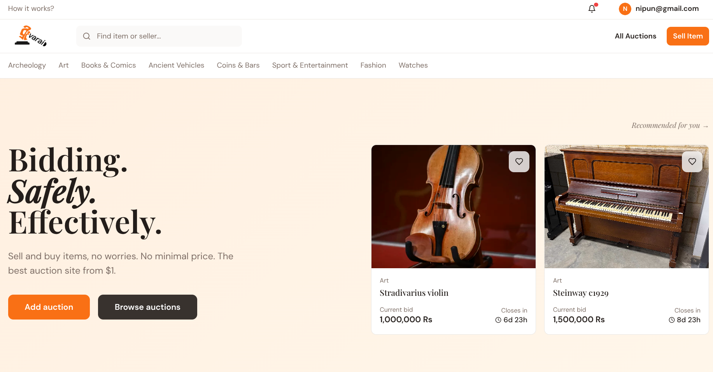
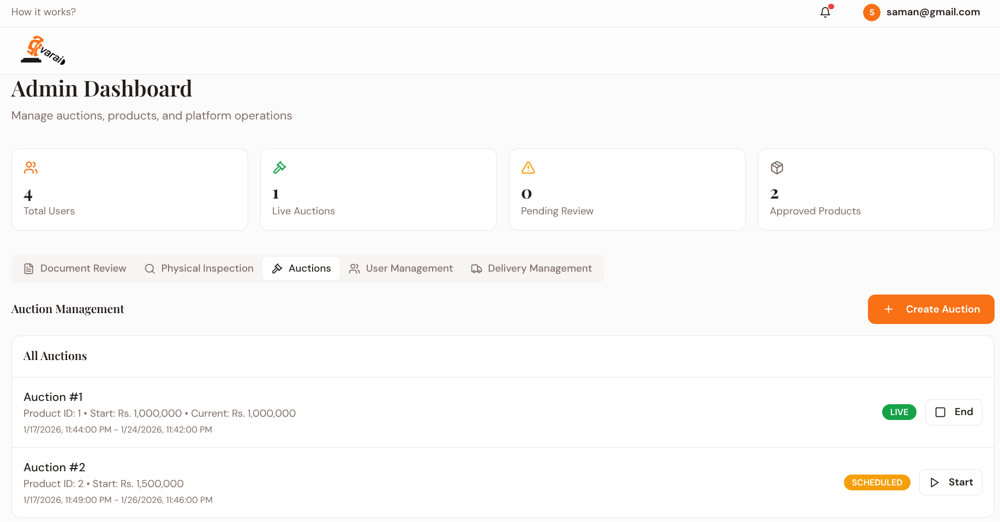
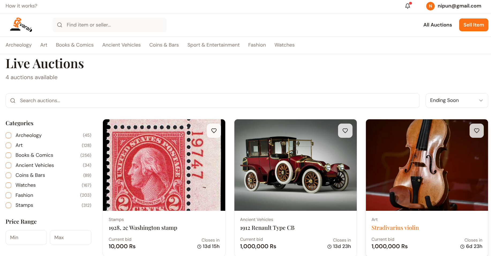
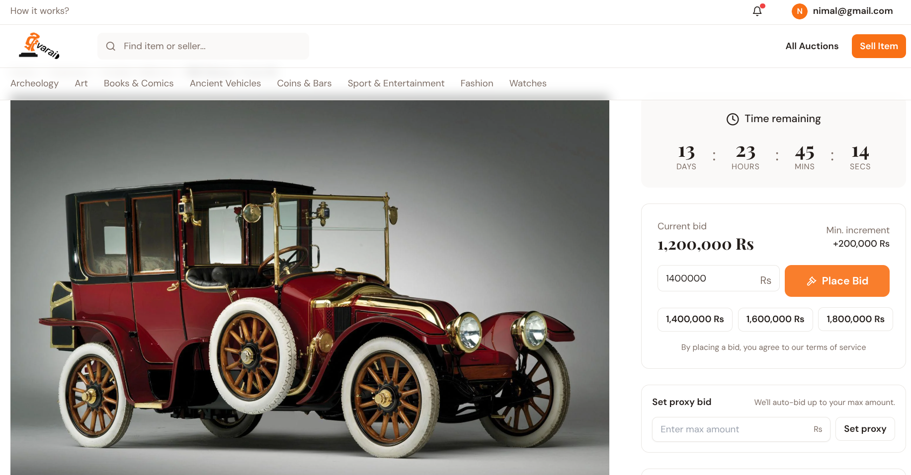
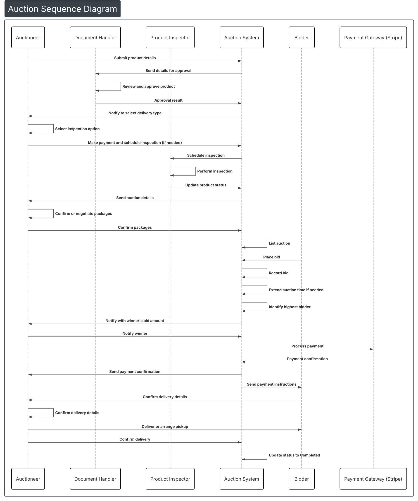
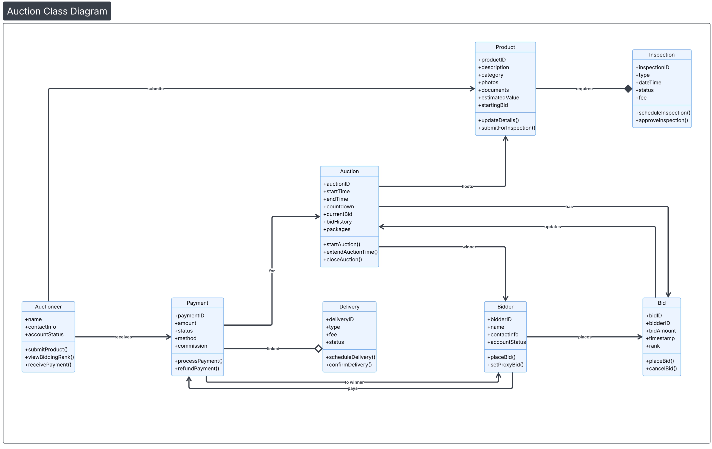
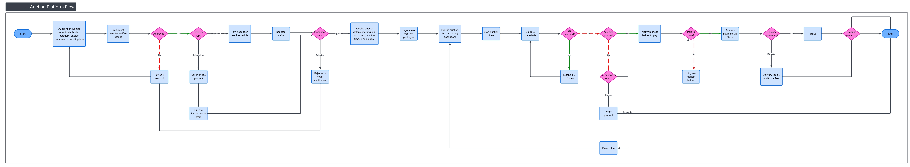

<table align="center" border="0">
  <tr>
    <td align="center" border="0">
      <br />
    </td>
    <td align="center" border="0">
      <br />
      <em>Scan to visit the live demo</em>
    </td>
  </tr>
</table>

<h1 align="center">Aevarai - Online Auction Platform</h1>

<p align="center">
  <strong>A modern, full-stack auction platform built with React & Spring Boot</strong>
</p>

<p align="center">
  
  
  
  
  
</p>

<p align="center">
  <a href="https://aevarai.netlify.app" target="_blank">
    
  </a>
</p>


---

## Table of Contents

- [Features](#features)
- [Tech Stack](#tech-stack)
- [Project Structure](#project-structure)
- [Setup & Installation](#setup--installation)
- [Environment Variables](#environment-variables)
- [System Diagrams](#system-diagrams)
- [API Documentation](#api-documentation)
- [Screenshots](#screenshots)

---

## Features

### User Features
- **User Authentication** - Secure JWT-based login/registration
- **Browse Auctions** - View live and upcoming auctions
- **Real-time Bidding** - Place bids on active auctions
- **My Bids** - Track all your placed bids
- **Won Auctions** - View auctions you've won
- **Checkout & Payment** - Secure Stripe payment integration
- **User Profile** - Manage your account settings
- **Notifications** - Real-time auction notifications

### Seller Features
- **Seller Dashboard** - Analytics and sales overview
- **Product Management** - Add, edit, delete products
- **Auction Management** - Create and manage auctions
- **Sales Tracking** - Monitor your sales history

### Inspector Features
- **Product Inspection** - Verify product authenticity
- **Inspection Dashboard** - Manage inspection queue

### Admin Features
- **Admin Dashboard** - Platform-wide analytics
- **User Management** - Manage all platform users
- **Auction Oversight** - Monitor all auctions


<table>
<tr>
    <td><b>Home Page</b></td>
  </tr>
  <tr>
    <td></td>
  </tr>
  <tr>
</table>
---

## Tech Stack

### Frontend
| Technology | Purpose |
|------------|---------|
| React 18.3 | UI Framework |
| TypeScript | Type Safety |
| Vite | Build Tool |
| TailwindCSS | Styling |
| Shadcn/UI | Component Library |
| React Query | Data Fetching |
| React Router | Navigation |

### Backend
| Technology | Purpose |
|------------|---------|
| Spring Boot 3.5.9 | Java Framework |
| Spring Security | Authentication |
| Spring Data JPA | Database ORM |
| PostgreSQL | Database |
| JWT | Token Authentication |
| Stripe | Payment Processing |

---

## Project Structure

```
aevarai/
├── backend/                          # Spring Boot Backend
│   ├── src/main/java/com/example/auction/
│   │   ├── admin/                    # Admin module
│   │   ├── auction/                  # Auction management
│   │   ├── auth/                     # Authentication & JWT
│   │   ├── bidding/                  # Bidding logic
│   │   ├── config/                   # App configuration
│   │   ├── delivery/                 # Delivery management
│   │   ├── inspection/               # Product inspection
│   │   ├── notification/             # Notifications
│   │   ├── payment/                  # Stripe payments
│   │   ├── product/                  # Product management
│   │   ├── security/                 # Security config
│   │   ├── seller/                   # Seller features
│   │   └── AuctionApplication.java   # Main entry
│   ├── src/main/resources/
│   │   └── application.yaml          # App configuration
│   ├── pom.xml                       # Maven dependencies
│   └── mvnw                          # Maven wrapper
│
├── frontend/                         # React Frontend
│   ├── src/
│   │   ├── components/               # Reusable UI components
│   │   ├── contexts/                 # React contexts (Auth)
│   │   ├── lib/                      # Utilities
│   │   ├── pages/                    # Page components
│   │   │   ├── admin/                # Admin pages
│   │   │   ├── seller/               # Seller pages
│   │   │   ├── inspector/            # Inspector pages
│   │   │   └── *.tsx                 # Public pages
│   │   ├── App.tsx                   # App routes
│   │   └── main.tsx                  # Entry point
│   ├── public/                       # Static assets
│   ├── package.json                  # NPM dependencies
│   └── vite.config.ts                # Vite configuration
│
└── README.md                         # This file
```

---

## Setup & Installation

### Prerequisites

- **Node.js** (v18+) or **Bun**
- **Java JDK** (17+)
- **PostgreSQL** (local or cloud like Neon)

### 1. Clone the Repository

```bash
git clone https://github.com/yourusername/aevarai.git
cd aevarai
```

### 2. Backend Setup

```bash
# Navigate to backend
cd backend

# Configure database in application.yaml
# Edit src/main/resources/application.yaml with your database credentials

# Run the Spring Boot application
./mvnw spring-boot:run
```

The backend will start on **http://localhost:8080**

### 3. Frontend Setup

```bash
# Navigate to frontend
cd frontend

# Install dependencies
npm install

# Run the development server
npm run dev
```

The frontend will start on **http://localhost:5173**

---

## Environment Variables

### Backend (`backend/src/main/resources/application.yaml`)

```yaml
spring:
  datasource:
    url: ${DATABASE_URL:jdbc:postgresql://localhost:5432/auction_db}
    username: ${DATABASE_USERNAME:postgres}
    password: ${DATABASE_PASSWORD:your_password}
  jpa:
    hibernate:
      ddl-auto: update

# Add your Stripe keys
stripe:
  secret-key: ${STRIPE_SECRET_KEY:sk_test_xxx}
```

### Frontend (`frontend/.env`)

```env
VITE_BACKEND_URL=http://localhost:8080
VITE_SUPABASE_URL=your_supabase_url
VITE_SUPABASE_ANON_KEY=your_supabase_key

```
### Screenshots


<table >
  <tr>
    <td><b>Admin Dashboard</b></td>
  </tr>
  <tr>
    <td></td>
  </tr>
  <tr>
    <td><b>All Auctions</b></td>
  </tr>
  <tr>
    <td></td>
  </tr>
  <tr>
    <td><b>Product Detail</b></td>
  </tr>
  <tr>
    <td></td>
  </tr>
 
</table>


## System Diagrams
---
### 1. Entity Relationship Diagram (ERD)


### 2. Sequence Diagram - Bidding Flow


### 3. Class Diagram - Core Domain


### 4. Application Flow Diagram


---

## Testing Credentials

Use the following test accounts to explore different roles:

| Role | Email | Password |
|------|-------|----------|
| **Admin** | saman@gmail.com | Saman123 |
| **Inspector** | kamal@gmail.com | Kamal123 |
| **Auctioneer/Seller** | nipun@gmail.com | Nipun123 |
| **Bidder** | nimal@gmail.com | Nimal123 |


---

## API Documentation
---
The backend exposes RESTful APIs. Key endpoints include:

| Module | Endpoint | Description |
|--------|----------|-------------|
| **Auth** | `POST /api/auth/register` | User registration |
| **Auth** | `POST /api/auth/login` | User login |
| **Auctions** | `GET /api/auctions` | List all auctions |
| **Auctions** | `GET /api/auctions/{id}` | Get auction details |
| **Bids** | `POST /api/bids` | Place a bid |
| **Products** | `GET /api/products` | List products |
| **Products** | `POST /api/products` | Create product |
| **Payments** | `POST /api/payments/create-intent` | Create Stripe intent |
| **Seller** | `GET /api/seller/dashboard` | Seller analytics |

For detailed API documentation, import the Postman collection from `backend/Auction-Platform-Postman-Collection.json`

---


## Collaborators

| Name | GitHub |
|------|--------|
| Imihami Thammennawa | [@vishwathilina](https://github.com/vishwathilina) |
| Geemal Muhutugala | [@Geemal2004](https://github.com/Geemal2004) |
| Kande Madithya | [@KVKMadithya](https://github.com/KVKMadithya) |
| Weerakkody Weerakkody | [@2004-weerakkody](https://github.com/2004-weerakkody) |
| Rivin Fernando| [@rivinfernando525-stack](https://github.com/rivinfernando525-stack) |
| Selladurai Prageeth | [@prageeth-23](https://github.com/prageeth-23) |
| Koswaththe Koswaththa| [@koswaththamaleesha](https://github.com/koswaththamaleesha) |
---

<p align="center">
  Made by the Aevarai Team
</p>
